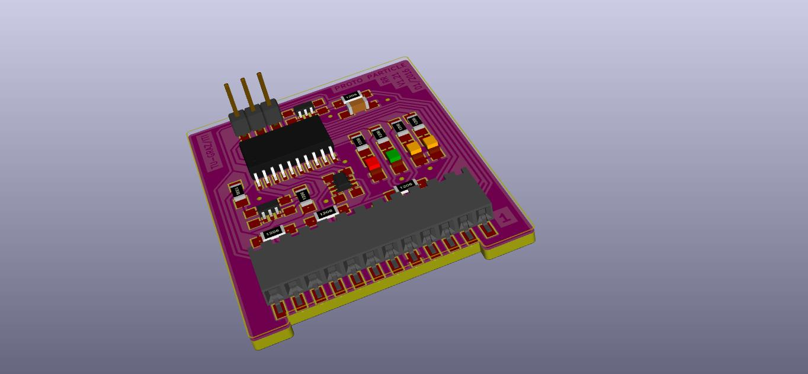
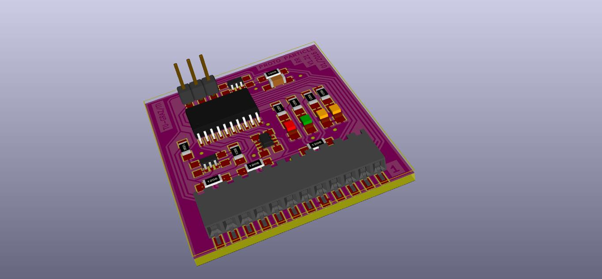
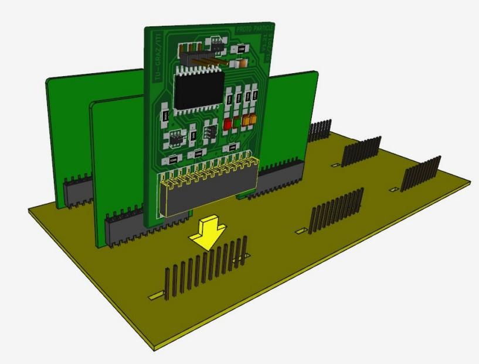
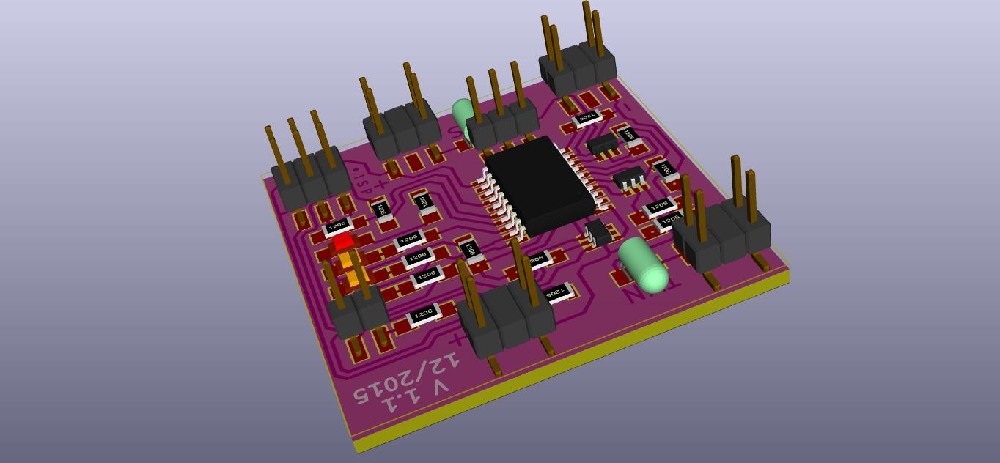
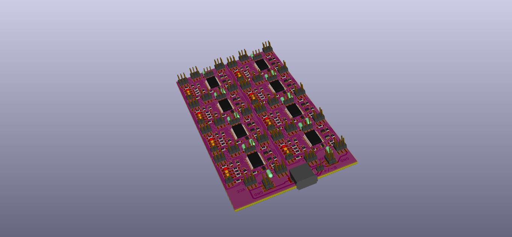
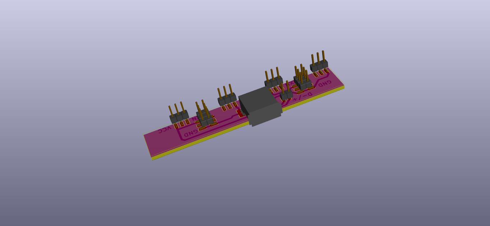
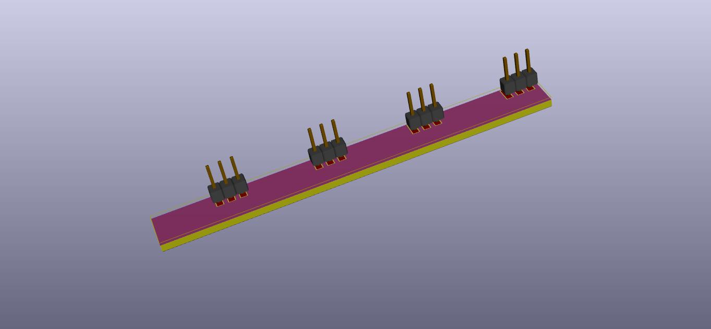
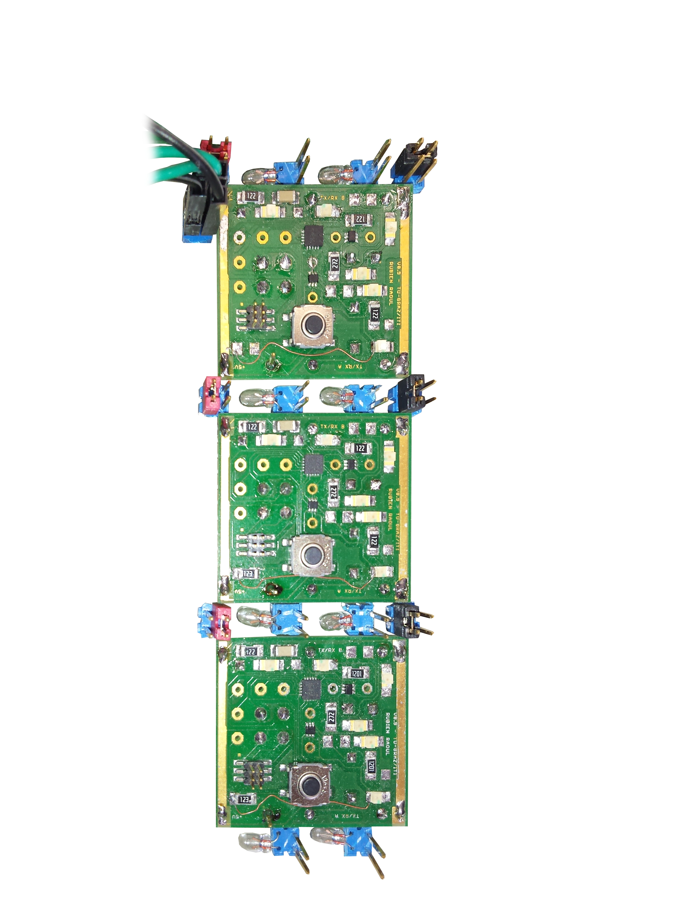

Particle Hardware Repository
----------------------------
Hardware development repository for the particle and related hardware.

## Folder content
* **pcb-projects**: pcb projects
* **freecad**: 3D Models drawn with [FreeCAD](http://www.freecadweb.org/)
* **reflow**: reflow soldering logs, charts and helper

## PCB Projects/Versions
### Particle Version 1.21
|   |   |   |
|---|---|---|
|  |  |  |
| plugable particle with leads | pluggable particle | grid board illustartion |

### Particle version 1.1

|   |   |   | 
|---|---|---|
||||
| single particle | array example | array header |
|  | | | 
| array tail | | |

### Particle version 0.9
|   |
|---|
||
| chain example |
